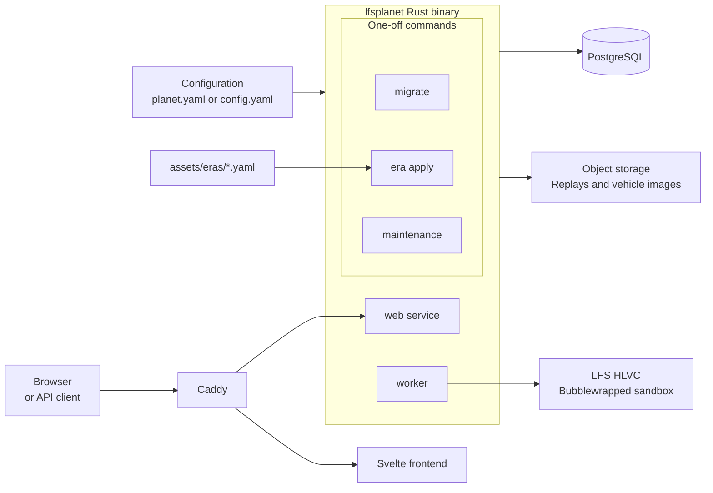

# Architecture

lfspla.net is a Rust API and worker using PostgreSQL, with a Svelte frontend.



## Eras

The YAML files in `assets/eras/` are setup files. Apply them explicitly:

```sh
lfsplanet maintenance catalogue-sync
lfsplanet era apply assets/eras/*.yaml
```

`catalogue-sync` adds tracks and vehicles. `era apply` checks and saves eras in
one transaction. New eras need no confirmation; changes need `--yes`. Startup
does not apply these files.

## HLVC worker

Uploads are parsed, queued, and matched to an open era. Run the worker
separately:

```sh
lfsplanet worker
```

The worker validates queued hotlaps with the era's LFS installation, Wine, and
Bubblewrap. It publishes valid laps and records all other results. See [replay
validation](validator.md) for host requirements.
