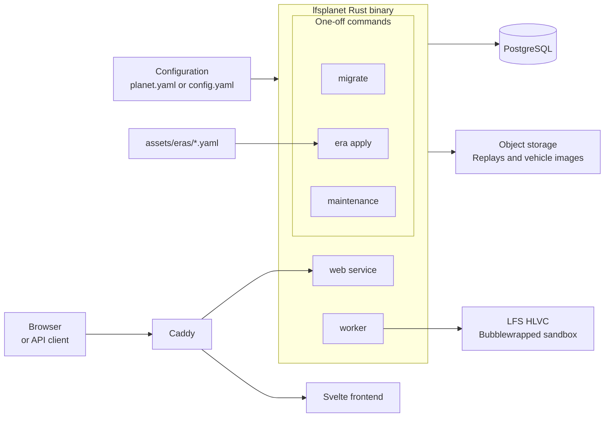

# Architecture

lfspla.net is a Rust API and worker using PostgreSQL, with a Svelte frontend.


```mermaid
flowchart LR
    User[Browser\nor API client] --> Caddy[Caddy]
    Caddy --> Frontend[Svelte frontend]
    Caddy --> Web[web service]

    subgraph App["lfsplanet Rust binary"]
        Web
        Worker[worker]
        subgraph Commands[One-off commands]
            Migrate[migrate]
            Eras[era apply]
            Maintenance[maintenance]
        end
    end

    App --> Database[(PostgreSQL)]
    App --> Storage[Object storage\nReplays and vehicle images]
    Worker --> Game[LFS HLVC\nBubblewrapped sandbox]
    Config[Configuration\nplanet.yaml or config.yaml] --> App
    EraFiles["assets/eras/*.yaml"] --> Eras
```

## Application code

Each database concept has a singular module in `src/models`. Modules with
submodules use a directory with `mod.rs`, such as `player/mod.rs`,
`hotlap/mod.rs`, `era/mod.rs`, and `ranking/mod.rs`. The entry file defines the
SeaORM row, relations, reusable scopes, and basic operations. Larger
implementations live alongside it, such as `player/profile.rs` and
`ranking/standings.rs`. Standalone leaf modules use a single `.rs` file.

Application callers use named records exported from `models`, for example
`Player::find_by_username`, `Era::find_by_slug`, and `Hotlap::count_outstanding`.
SeaORM's `Entity`, `Column`, and `ActiveModel` remain available in the singular
model module when a caller needs to compose a query. Read models such as
`ChartLeaderboard`, `HotlapActivity`, and `RankingWithCharts` own joined and
aggregated reads.

`src/services` owns complete application workflows:

`manage_lfs/mod.rs` owns installation downloads and caching, installation and
update workflows, path resolution, and reviewed trimming. The LFS CLI owns
arguments, confirmation, and presentation. Validation shares the service's
installation resolver. `src/lfs` retains API client construction and the shared
installation identifier validation used by era definitions.

`repair_eras/mod.rs` owns stored-version reclassification and its transactional
personal-best rebuild, followed by badge refreshes. `storage_gc/mod.rs` owns
object retention checks and deletion, with progress supplied to the caller and
summaries returned for presentation. Player restriction updates belong to
`Player` methods.

CLI command groups keep their argument definitions beside dispatch in `mod.rs`.
`cli::run` owns top-level dispatch; `main.rs` configures logging and parses the
arguments. Small LFS command adapters live directly in `cli/lfs/mod.rs`, while
trim confirmation and output remain in `cli/lfs/trim.rs`.

| Service           | Responsibility                                                                            |
| ----------------- | ----------------------------------------------------------------------------------------- |
| `submit_hotlap`   | Parse a replay, resolve its vehicle, store its bytes, and admit the submission            |
| `validate_hotlap` | Run LFS validation, publish the result, update personal bests, and queue notifications    |
| `apply_eras`      | Review and apply catalogue changes under one transaction and rebuild affected projections |
| `deliver_webhook` | Send queued notifications and record delivery, cooldown, and retry outcomes               |
| `sync_catalogue`  | Synchronise tracks, vehicles, upstream mod metadata, and artwork                          |

The validation and delivery services implement `lfsplanet_jobs::Processor`
directly. `cli/worker.rs` constructs and registers them with the generic runner;
there is no separate application jobs layer.

HTTP handlers own request parsing, authentication, and response formatting.
CLI commands own file input, operator confirmation, and terminal output. Both
call services and model operations. Services and models do not depend on these
entrypoints.

`src/db` owns connection setup, migrations, shared advisory locks, SQL binding
helpers, and checked PostgreSQL value conversions. Feature SQL stays with its
model. `personal_best` owns both incremental updates and bulk rebuilds;
`badge/refresh.rs` owns award calculation and refresh retries.

Transaction boundaries belong to the operation coordinating the changes.
Publication updates, personal bests, and notification snapshots commit together.
Catalogue changes retain their exclusive lock through projection rebuilding.
External LFS runtime operations use the standalone `lfsplanet_lfs` crate and its
platform-selected implementation.

## Eras

The YAML files in `assets/eras/` are setup files. Apply them explicitly:

```sh
lfsplanet maintenance catalogue-sync
lfsplanet era apply assets/eras/*.yaml
```

`catalogue-sync` adds tracks and vehicles. `era apply` checks and saves eras in
one transaction. New eras need no confirmation; changes need `--yes`. Startup
does not apply these files.

## HLVC worker

Uploads are parsed, queued, and matched to an open era. Run the worker
separately:

```sh
lfsplanet worker
```

The worker validates queued hotlaps with the era's LFS installation, Wine, and
Bubblewrap. It publishes valid laps and records all other results. See [replay
validation](validator.md) for host requirements.
